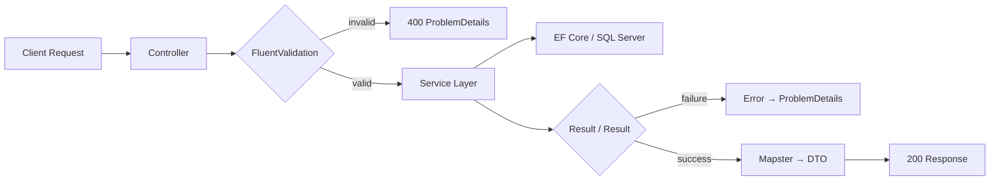
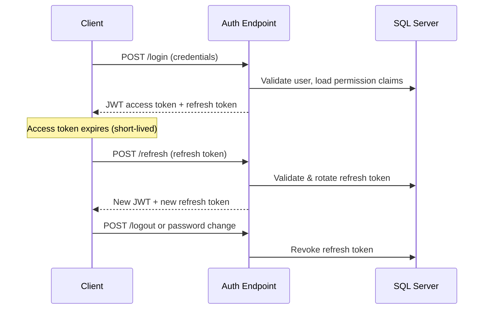

**Request lifecycle:**

**Auth & refresh-token flow:**

## Authentication & Authorization

- **JWT access tokens** with a short expiry, signed with a symmetric key
- **Refresh tokens** stored per user, rotated on every refresh, and revoked on logout or password change
- A background job cleans up expired/revoked refresh tokens on a daily schedule
- Standard **role-based** authorization (`[Authorize(Roles = "Admin")]`) for admin-only endpoints
- A custom **permission-based** authorization system (`[HasPermission("courses:update")]`) layered on top of roles, backed by a dedicated `IAuthorizationPolicyProvider` and `IAuthorizationHandler`, so access can be controlled at a finer grain than role alone

## Roles & Permissions

Three roles are seeded by default:

| Role                 | Access                                                                                       |
| -------------------- | --------------------------------------------------------------------------------------------- |
| **Admin**            | Full access to every permission in the system, plus user management                           |
| **Instructor**       | Full CRUD on their own courses, sections, and lessons; read access to categories and reviews  |
| **Member** (default) | Browse courses, enroll, and manage their own reviews and profile                              |

Permissions are stored as role claims in the database and issued as claims in the JWT on login, so authorization checks don't require a database round-trip per request.

## Courses, Sections & Lessons

- Full CRUD for Courses, Sections, and Lessons, with instructor-ownership enforced on writes (Admins can manage any course)
- Course search and category filtering
- Lesson content is organized by Course → Section → Lesson, with a dedicated endpoint to fetch a course's full content tree in one call

## Enrollments

- Students enroll in a course once (enforced at the database level with a unique constraint, not just in application code)
- Students can view their own enrollments

## Reviews

- Students can leave one review per course they're enrolled in, and can update or delete only their own reviews
- Reviews are paginated per course

## Email Confirmation & Password Reset

- New accounts must confirm their email before receiving any role/permissions
- Password reset and email confirmation both use time-limited, single-use tokens generated by ASP.NET Core Identity, sent via a background email job — never logged in plaintext

## Background Jobs (Hangfire)

- **Recurring job**: daily cleanup of expired/revoked refresh tokens
- **Fire-and-forget jobs**: outbound emails (confirmation, password reset) are queued rather than sent inline, so a slow mail server never blocks an API request
- The Hangfire dashboard (`/jobs`) is restricted to authenticated Admin users

## Caching

`HybridCache` is used for read-heavy, rarely-changing data (course content trees) to reduce database load on repeated requests.

## Rate Limiting

Built-in ASP.NET Core rate limiting is applied to sensitive/public endpoints:

- IP-based limiting on public auth endpoints (register, login, password reset)
- User-based limiting on selected authenticated endpoints

## Health Checks

Exposed at `/health`, covering:

- SQL Server connectivity
- Hangfire job storage
- SMTP/mail provider connectivity

## Logging

Serilog writes structured logs to the console (and rolling files in non-development environments). Logging is deliberately scoped to avoid ever recording passwords, JWTs, refresh tokens, or confirmation/reset codes.

## Validation & Mapping

- **FluentValidation** validators run automatically against incoming request DTOs
- **Mapster** handles entity ↔ DTO mapping with minimal boilerplate

## Result Pattern & Error Handling

Services return a `Result`/`Result<T>` type rather than throwing for expected failure cases, which controllers translate into RFC 7807 `ProblemDetails` responses. A global exception handler catches unhandled exceptions so clients never see raw stack traces.

## Testing

There is currently no automated test suite (no unit, integration, or functional tests) — this is the most significant gap versus a production-grade template and is tracked as a roadmap item. In the meantime, the API has been verified manually end-to-end using the Postman collection linked above, against both the local environment and the deployed instance.

## Local Setup

**Prerequisites:** .NET 10 SDK, SQL Server (LocalDB is fine for local development)
